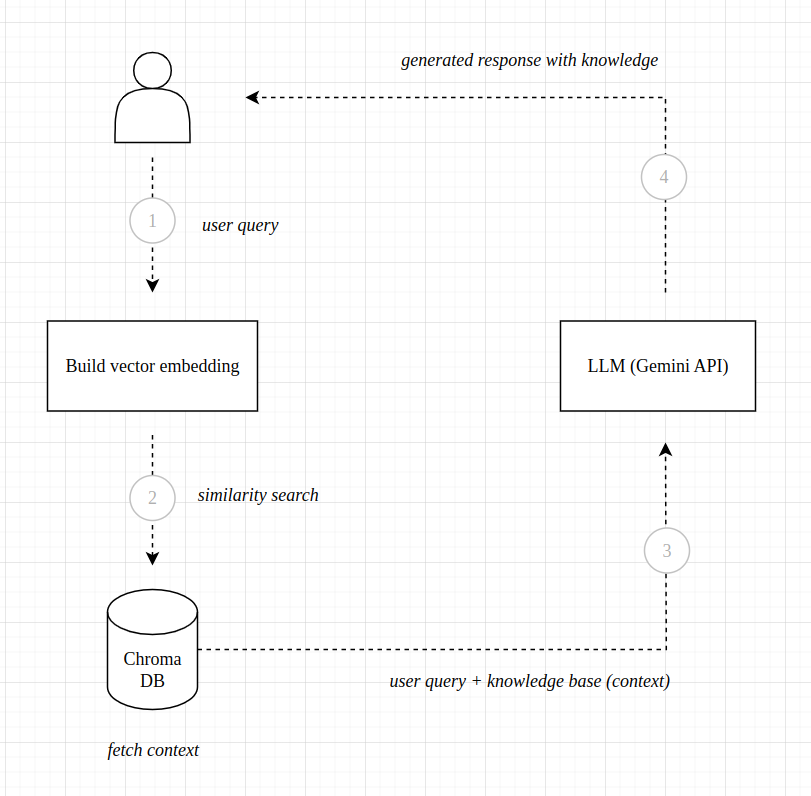

# Basic RAG LLM implementation using Gemini API, Chroma DB and Hugging Face embedding model.

## Description
This project demonstrates the use of basic RAG flow with LLM.

- Store data (wikipedia - zomato) in Chroma DB (vector storage).
- Consume user queries and extract knowledge from Chroma DB.
- Build prompt template using raw user query and extracted knowledge (as base).
- Cater response.


<div align="center">

</div>


## How to run

1. Install requirements.
   ```
   pip install -r requirements.txt
   ```
2. Setup env file (.env)
   ```
   API_KEY=<API_KEY>
   HUGGING_FACE_TOKEN=<HF_TOKEN>
   ```
3. Load data to Chroma DB.
   ```
   load_data_to_chromadb()
   ```

4. Run file.
   ```
   python3 main.py
   ```

## Documentation & Reference

[Chroma DB](https://www.trychroma.com/)
<br>
[Hugging Face Embedding Model](https://huggingface.co/blog/getting-started-with-embeddings)
<br>
[Gemini API](https://ai.google.dev/gemini-api/docs?authuser=2)
